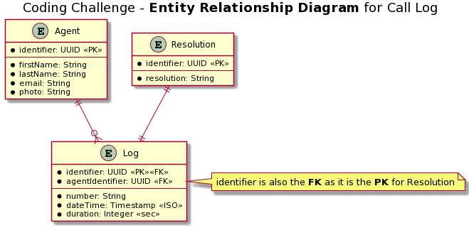

# Frontend / Javascipt - coding challenge.

Welcome to Legal One coding challenge, through this challenge we get to know you better from the coding side of you. let's start.

recommended: a good cup of coffee ☕ and lo-fi coding music 🎵.

---

## The Solution:

### Wireframe and Rough Visual Design

[**Figma Design 🎨 Link**](https://www.figma.com/file/fnRgIBVpHLpd8zitLdwH3v/Legal-One-Challenge?node-id=0%3A1)

The above link opens up the mockup designs for the website developed as a solution to the challenge.

The designs and development is planned in a component driven approch and design system is created considering the concepts of Brad Frost's [**Atomic Design System**](https://atomicdesign.bradfrost.com/)

### Screen Shots

#### Dashboard Desktop View

#### Dashboard Mobile View

#### Storybook Screen

### Entity Relationship Diagram for json data

[**Check the uml code here**](entity_relationship_diagram.plantuml)

### Available Scripts

### `npm run setup`

This will install all the required npm packages for frontend and backend codebase at once.

The actual command behind script.
`cd backend && npm install && cd .. && cd frontend && npm install`

### `npm run storybook`

Runs the storybook in the development mode to visualise and test the UI components.
Open [http://localhost:6006](http://localhost:3000) to view it in the browser.

The actual command behind script.
`cd frontend && npm run storybook`

### `npm run server`

Runs the nodejs backend app in the development mode.
Open [http://localhost:8000](http://localhost:3000) to view it in the browser.

The actual command behind script.
`cd backend && node index.js`

### `npm run client`

Runs the frontend app in the development mode.
Open [http://localhost:3000](http://localhost:3000) to view it in the browser.

The actual command behind script.
`cd frontend && npm start`

### `npm run check`

Check the code with prettier.

The actual command behind script.
`cd backend && npx prettier --check . && cd .. && cd frontend && npx prettier --check .`

### `npm run format`

Format the code with prettier.

The actual command behind script.
`cd backend && npx prettier --write . && cd .. && cd frontend && npx prettier --write .`

## The challenge:

A call center makes tons of calls daily through call center agents and these calls are dumped in JSON files. We need you to handle this large amount of data, and present it in a nice way for the supervisors.

The issue with the data is the structure, it is spread across multiple files. We need your mind to solve this issue and present the data in a useful way.

## Tech TODO:

### 1. The first part:

Create a simple nodeJS app that can serve the data. You can use any nodeJS framework for that. The data in `json-data` folder should not be changed.

### 2. The second part:

Create an app which uses a modern JS frontend framework _(e.g. Vue, React, etc...)_. The frontend app should have these routes:

- `/` a home page to show an aggregated table for the calls, for ex:

  | Phone number | Number of calls | Last call details  |
  | ------------ | --------------- | ------------------ |
  | +49151484522 | 3 calls         | Agent name / 11:46 |
  | +49158544147 | 1 call          | Agent name / 14:46 |
  | +49151783331 | 2 calls         | Agent name / 16:46 |

  by clicking on the agent name it would go to the agent log

  by clicking on the **Phone number** it would go to that number log

- `/agent/${ID}` to show an agent specific call log, for ex:

  | Phone number | Call date and time | Resolution      |
  | ------------ | ------------------ | --------------- |
  | +49151484522 | 22/1/2020 14:20:22 | need reschedule |
  | +49158544147 | 22/1/2020 16:54:12 | no response     |
  | +49158544147 | 22/1/2020 17:54:12 | no response     |

- `/call/${number}` to show call logs of a specific number

  | Agent Name | Call date and time | Resolution      |
  | ---------- | ------------------ | --------------- |
  | John Bob   | 22/1/2020 14:20:22 | need reschedule |
  | Chris Toms | 22/1/2020 17:54:12 | no response     |
  | John Bob   | 22/1/2020 17:54:12 | no response     |

## Important notes:

- app should run with no errors nor hiccups.
- the data in `json-data` folder should not be changed!.
- representing the data using charts is a plus.
- unit testing of the code is a plus.

## Submission:

Fork this repo and submit your application either via PR or email. Add build, test and run scripts to package.json (if applicable).

## Happy coding !
